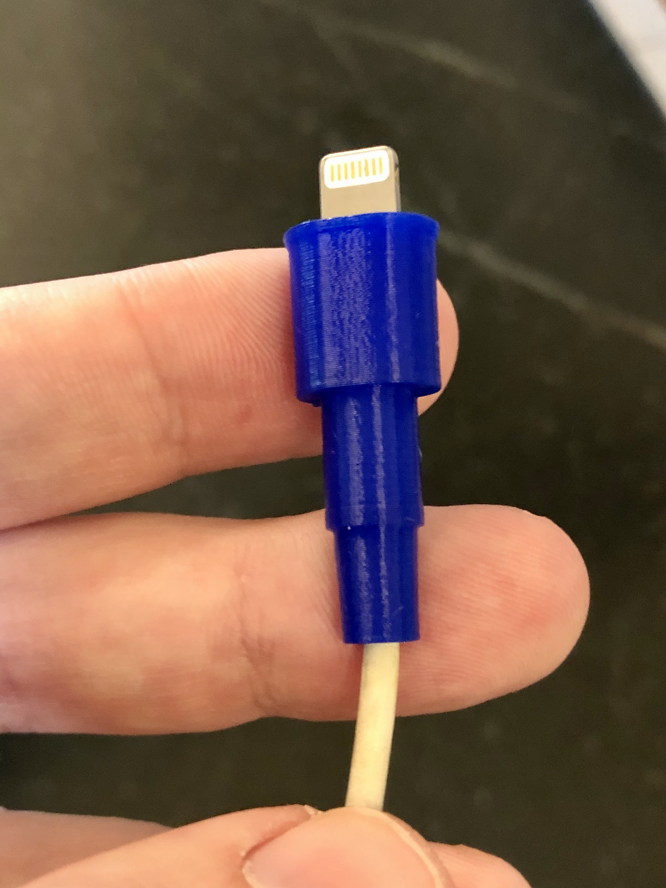

# Bendy - Lightning Cable Kink Guard

Bendy helps stabilizing frayed and kinked ends of Apple Lightning cables and was designed to print without support using flexible materials like NinjaTek's [Cheetah](https://www.amazon.com/s?k=ninjatek+cheetah+1.75&amp;ref=nb_sb_noss&_encoding=UTF8&tag=aph0dc-20&linkCode=ur2&linkId=15a98dd7b4b8def6da9c32956eb9468a&camp=1789&creative=9325) or [NinjaFlex](https://www.amazon.com/s?k=ninjatek+ninjaflex+1.75&amp;ref=nb_sb_noss_1&_encoding=UTF8&tag=aph0dc-20&linkCode=ur2&linkId=57df3cdf6c305a70baeb6b9577934083&camp=1789&creative=9325).

I made my material property files publicly available that I use for printing Bendy using flexibles on the Prusa i3 MK2S using PrusaSlicer.

Cheetah sticks to BuildTak like crazy. No brim necessary for the little contact surface it has.

- Bendy-A: Use the files for Bendy-A when using a classic USB-A to Lightning cable.
- Bendy-C: Use the Bendy-C files for the latest USB-C to Lightning cable.

The Lightning port on the USB-A and USB-C cable have different dimensions.

## Links

- [NinjaTek Cheetah](https://github.com/aphex3k/3dp/blob/master/PrusaSlicer/filament/NinjaTek%20Cheetah%20FLEX.ini) material settings
- [Onshape](https://cad.onshape.com/documents/bc22977cccd1f696f4e8d592/w/354d7cd77f81b9a023a24c50/e/1e70ce18e520baba58223667)
- [Thingiverse](https://www.thingiverse.com/thing:4247502)

