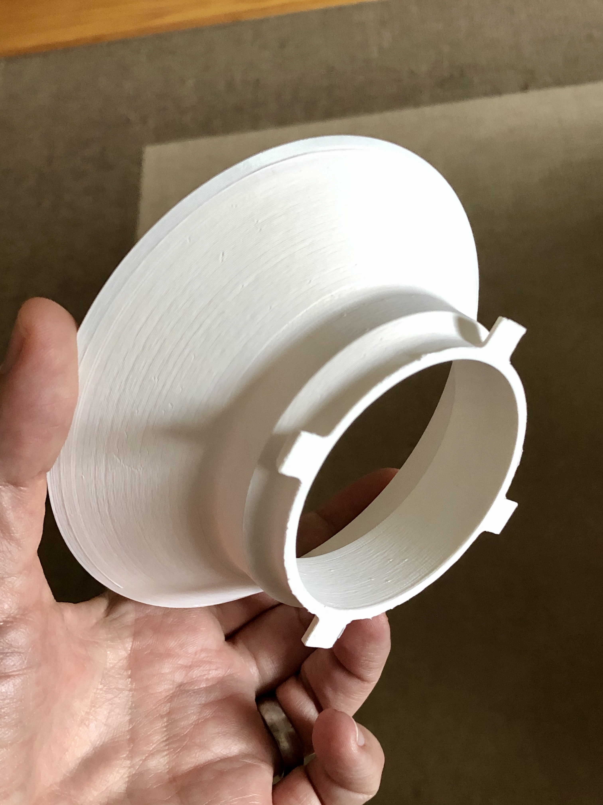
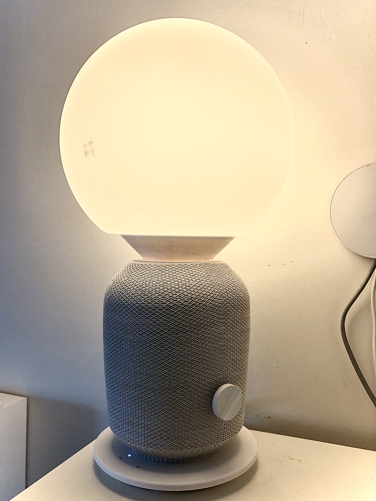

# SYMFONISK FADO

The story behind this model is fairly simple. My wife and I love shopping at IKEA and we are big fans of the AS-IS section of the store where you can get damaged or open-box goods for a steep discount. As of late, IKEA is selling Sonos compatible speakers with a lamp on top. We found one of them for a 75% discount in the AS-IS. The catch was that the lamp shade was broken and they would only sell the speaker base.

Using Onshape, I reverse modeled a mount that would fit the same place as the original lamp shade. The other side of the mount was constructed to have a FADO lamp shade sit on top of it.

The model prints without supports but the 45 degrees angle combined with the circular shape might have your printer vibrate depending on you slicer, settings and speed.

## Links
- [Onshape](https://cad.onshape.com/documents/08c4ce2ccd260908280f3883/w/27bc7a7e3a868fd614fe6a77/e/026bafc6c758940cea063ce2)
- [Thingiverse](https://www.thingiverse.com/thing:4241885)

## Copyright

The Company name, the term “IKEA”, and all related names, logos, product and service names, designs and slogans are [trademarks of Inter IKEA Systems B.V.](https://inter.ikea.com/en/about-us/terms-of-use/)