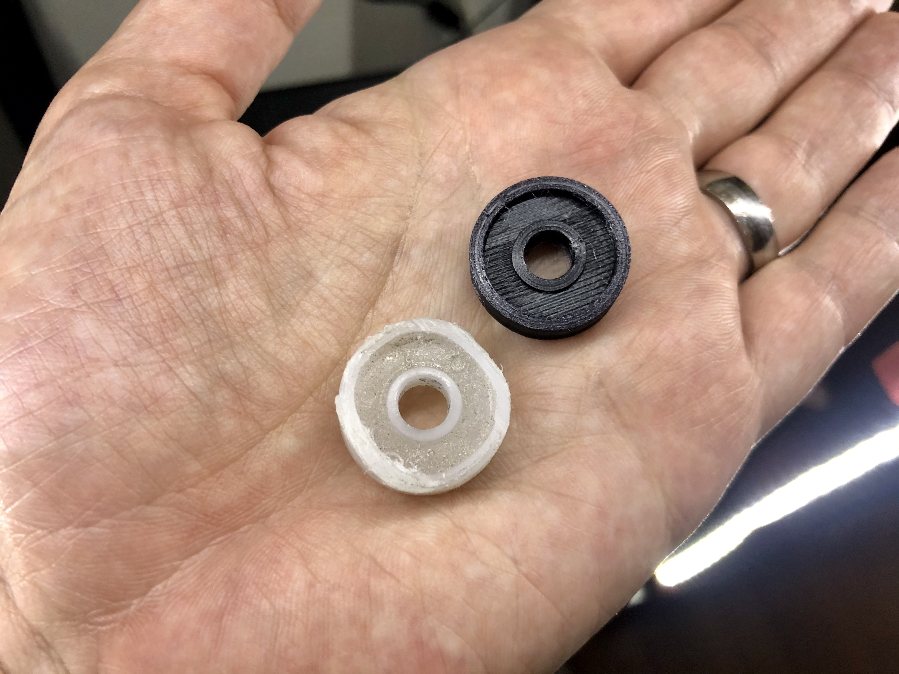
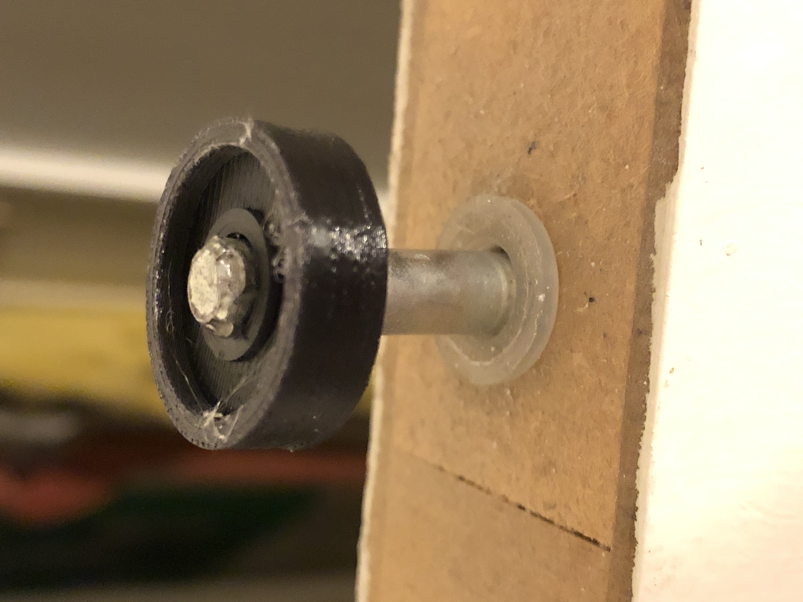

# Sliding Door - Wheel

The old house that our family lives in came with a folding sliding door and the kids wheren't really gentle to it. One of the sliding wheels in the rail sheered off and rendered the right side of the folding panels unusable.

## Recommended Print Settings

- I recommend printing it using supports, 20-25% infill at minimum and a low-fricting plastic like [Taulman's Bridge Nylon](https://amzn.to/367M6DN). It works perfectly in my case. 
- The [print profile](https://github.com/aphex3k/3dp/blob/master/PrusaSlicer/filament/Taulman%20Bridge%20NYLON.ini) that I use with Prusa Slicer for Nylon can be found on Github. 

## Links

 - [Onshape](https://cad.onshape.com/documents/83471ec28a11e8421d84216b/w/c5fe06c8a3b0f803c5d7e9d1/e/d21d7c7082b5370b76d3409f)
 - [Thingiverse](https://www.thingiverse.com/thing:4374954)

 