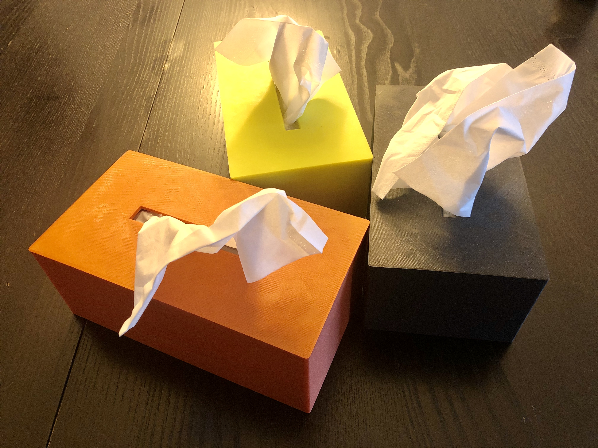

# Tissue Box Cover

1. The normal sized [Tissue Box Cover](Tissue%20Box%20Cover.stl) fits regular sized tissue boxes (typically containing 120 tissues at 8.2" x 8.4" or 20.8cm x 21.3cm).
1. The smaller sized [Small Tissue Box Cover](Small%20Tissue%20Box%20Cover.stl) fits small tissue boxes (typically containing 48 tissues at 8.2" x 8.4" or 20.8cm x 21.3cm).

In order to encourage my kids to use tissues more often I designed tissue box covers that they could put stickers on. These covers will fit your regular of the shelf tissue boxes.

- no supports needed, the print has plenty of contact surface to the print bed
- no infill necessary

## Links
- [Onshape](https://cad.onshape.com/documents/1d73e942e343c820a28eb81a/w/3ad4baf736dab8743bbe984b/e/3d68b603a01615b68bfcc105)
- [Thingiverse](https://www.thingiverse.com/thing:4241897)
